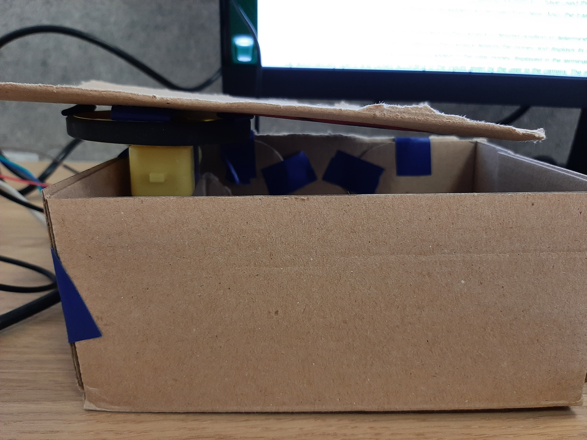

# Intelligent Moneybox on Jetson Nano
## Motivation
Children are imposed to save money and stop spending their money for unuseful products. They are given a moneybox and taught to save their money and hold them in their given moneyboxes. This is an appropriate approach to saving money. However, when time comes to summing up and declaring their total "wealth", things get a bit complicated. There can be various kinds of money magnitudes such as $5, $10... Grouping them, counting them, adding them up can be time consuming, and to be honest, a bit boring. Intelligent Moneybox can help solving this issue! 


<div align="center">
  
</div>
<br>

## Project
### Peripheral Devices
- Logitech C270 Webcam
- DC Motor and a Tire
- Stepper FeatherWing Motor Driver
- A Box
### Pin Configuration
I2C ports are used in this project. For reference look [here](https://learn.adafruit.com/adafruit-stepper-dc-motor-featherwing/pinouts). I2C data pins on the motor driver are connected to pin 3-5. Logic power pins are connected to 3.3V and GND. Jetson Nano is connected to the motor power pins via USB port. 1 of the motor output pins is used.
### How Does It Work?
Model dataset has been collected manually (5-10-20-50-100 Turkish Liras and 2 hand gestures to identify the money's situation whether it is getting in the money box or getting out from it). I have used the widget that has been created by the [Jetson-inference](https://github.com/dusty-nv/jetson-inference) library. The widget can be used from [here](https://github.com/dusty-nv/jetson-inference/blob/master/docs/pytorch-collect-detection.md). Also, the training script is present in the [same page](https://github.com/dusty-nv/jetson-inference/blob/master/docs/pytorch-collect-detection.md). \
The workflow is simple. User shows his/her hand to the camera in desired position to determine the moneyflow direction, in to or out of the moneybox. Later on, the camera detects the money and displays its magnitude. The magnitude of the money is substracted from or added to the total money displayed in the terminal. Moneybox's top automatically opens and closes according to the inputs given by the user to the camera. The motor's rotation is achieved via the functions and classes that are declared in the [Jetbot Tutorial](https://github.com/NVIDIA-AI-IOT/jetbot).
### How to Run?
1. Build Jetson-Inference from source with [this guide](https://github.com/dusty-nv/jetson-inference/blob/master/docs/building-repo-2.md#quick-reference).
2. Clone the project.
```
git clone https://github.com/yigitee/moneybox.git
```
3. Go to project directory.
```
cd moneybox
```
4. Enjoy!
```
python3 moneybox.py 
```
